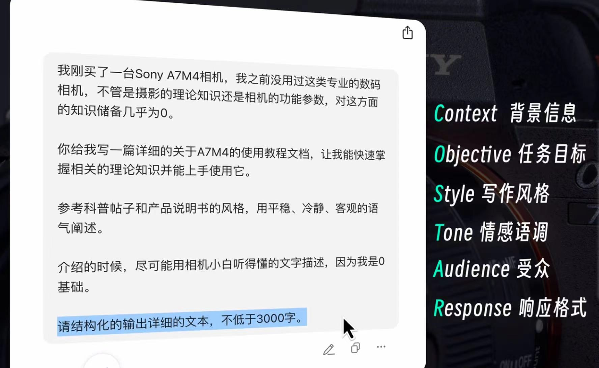
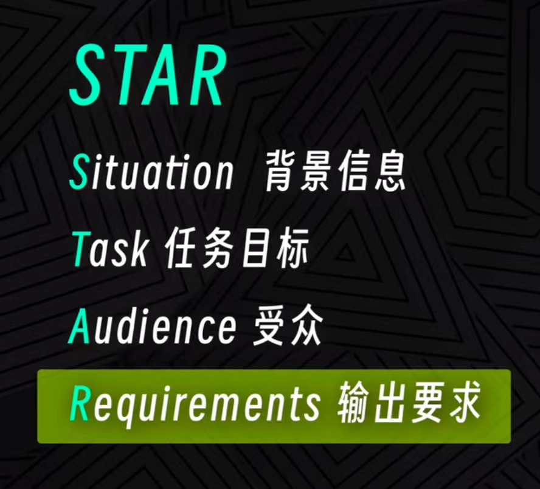
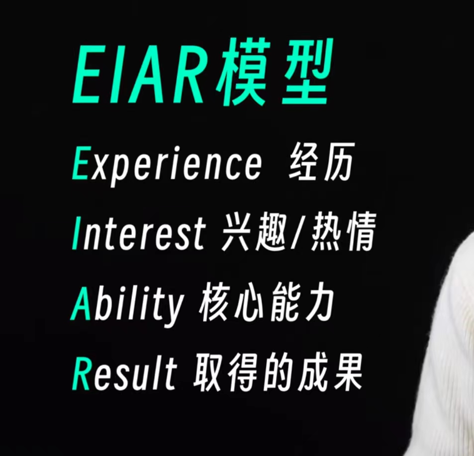
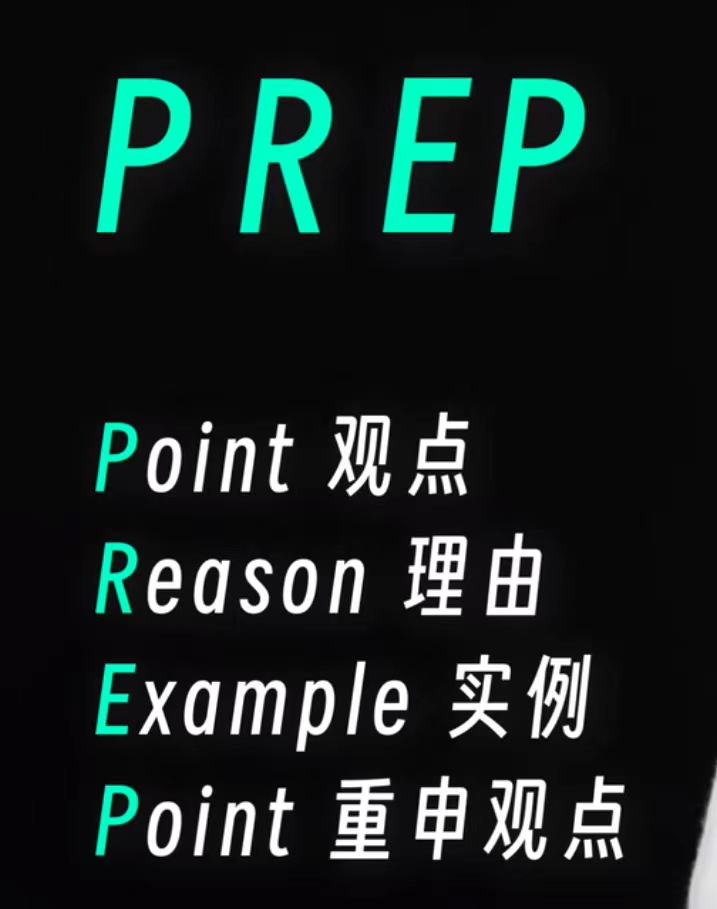

+++
title = 'AI提示词 / ai提示写作技巧'
date = 2024-11-13T19:10:50+08:00


categories = ["提示词"] 
tags = ["AI" , "提示词"]

+++


# 写作提示框架

## **COSTAR** 详细提示




> 示例

```c
我刚买了一台Sony A7M4相机 我之前没用过这类专业的数码相机，不管是摄影的理论知识还是相机的功能参数，对这方面的知识储备几乎为0。  //(背景信息)
    
你给我写一篇详细的关于A7M4的使用教程文档，让我能快速掌握相关的理论知识并能上手使用它 .     //(任务目标)
    
参考科普帖子和产品说明书的风格，用平稳、冷静、客观的语气阐述。 //(写作风格)
    
介绍的时候，尽可能用相机小白听得懂的文字描述，因为我是0基础。 //(情感语调) (受众)
    
请结构化的输出详细的文本，不低于 3000 字。 //(响应格式)
```


## STER ~~ **COSTAR** 精简提示




> 示例

```c
我刚买了一台Sony A7M4相机 我之前没用过这类专业的数码相机，不管是摄影的理论知识还是相机的功能参数，对这方面的知识储备几乎为0。  //(背景信息)

你给我写一篇详细的关于A7M4的使用教程文档，让我能快速掌握相关的理论知识并能上手使用它。   //(任务目标)

介绍的时候，尽可能用相机小白听得懂的文字描述，因为我是0基础。 // (受众)
    
参考科普帖子和产品说明书的风格，用平稳、冷静、客观的语气阐述。请结构化的输出详细的文本，不低于 3000 字。   //(输出要求)
```


# 自我介绍 

```c
请分别基于EIAR模型、USP模型，给我写2个版本的自我介绍
```







# 以问题扩展问题进行提问


```c
我想深入了解,系统学习,熟练掌握 xxx ，我应该问你什么问题？请给我列出10个
```

# 加上具体的例子   

```c
Add specific examples
```

# 帮我理顺并润色以上内容   

```c
help me organize and refine the content above.
```

# 科学写作专家 - 学术写作

```c
want you to act as an expert in scientific writing, l will provide you with some paragraphs in English and your task is to improve the spelling, grammar clarity, conciseness and overalreadability of the text providedwhile breaking down longsentences, reducing repetitionand providing improvementsuggestions. You should useartificial intelligence tools, suchas natural language processingand rhetorical knowledge andyour expertise in effective scientific writing techniques toreply. Provide the output as a markdown table with the head in Chinese. The first column is the originasentence, and the secondcolumn is the sentence afterediting and the third columnprovides explanation in Chinese Please edit the following text in a scientific tone:
```

- 加入这个提示词, 实现输入的文章**变成**学术语气的文章


