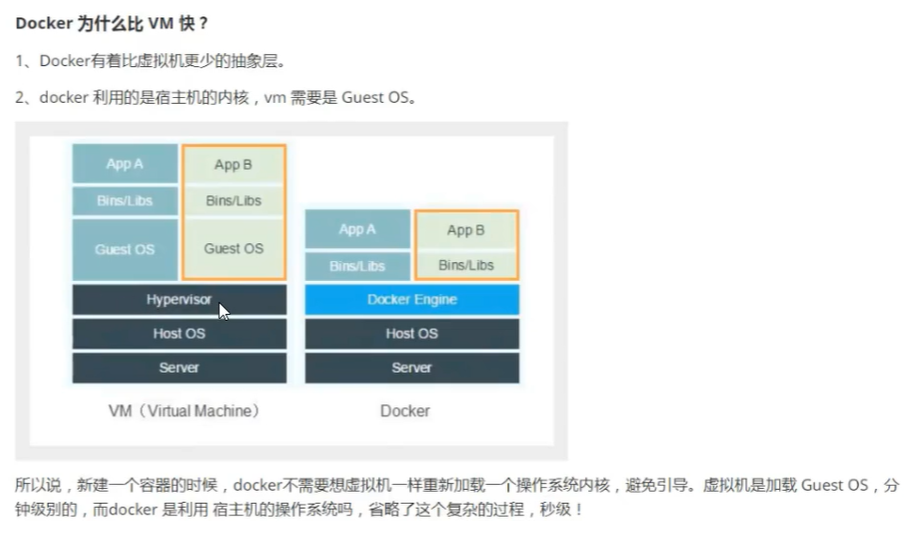
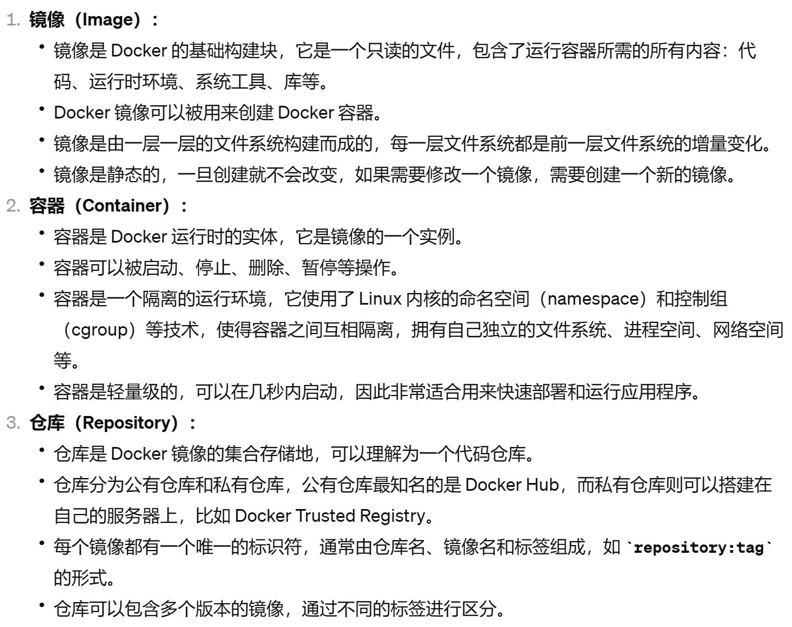
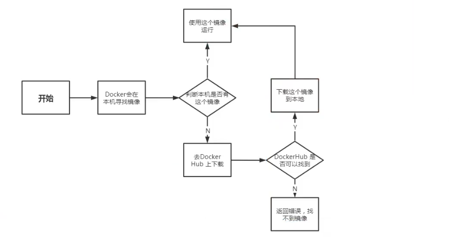

+++
title = 'Linux性能监视器开发'
date = 2024-11-22T00:12:29+08:00


categories = ["Linux" , "项目"]
tags = [ "Linux" , "项目"  ]

+++


# 1-Linux配置

- 虚拟机配置建议是：
- 虚拟机ubuntu镜像不要低于18.04 选择net模式，30-40G硬盘大小
- 硬盘一定要设置30-40G大小 
- 在ubuntu git clone 代码，千万不要在windows上下载，拷贝过去，windows会改变代码中可执行文件的权限和格式

## git 环境配置

### **github ssh 免密配置**

```Plain
sudo apt install openssh-server
sudo systemctl status ssh
sudo ufw allow ssh
cd ~/.ssh    
```

若`.ssh`目录不存在，则执行下面步骤，记得邮箱改成你自己的github注册邮箱。执行`ssh-keygen`命令的时候，弹出的几个提示框**全都回车跳过**，不需要做任何操作。

```Bash
mkdir ~/.ssh

cat ~/.ssh/id_rsa.pub
```

拷贝`id_rsa.pub`文件内容，复制到github setting中的ssh keys里面，即配置成功ssh公钥


### **Ubuntu git 拉取项目代码**

使用如下命令克隆项目代码

```Bash
mkdir work 
cd work
git clone git@github.com:xxxxxxxxxxxxxxxxxxxxxxxx
```


## **vscode 远程ssh 到ubuntu** 

如果是虚拟机，安装`net-tool` 后用 ifconfig 命令可以查看当前虚拟机的IP地址。如果是云服务器，则直接去控制台看云服务器的公网IP。

```Bash
sudo apt install net-tools
# 查看ip的命令如下
ifconfig
```

随后 vscode 安装远程连接工具，进行连接


Remote ssh新增一个ssh链接，输入如下命令链接你的Linux主机，随后会弹出目标主机系统是什么，选择Linux后，输入你的ssh密码就可以链接远程主机了。

```Plain
ssh 用户名@IP地址
```


## **项目docker模块构建** 

### **安装docker**

```Bash
sudo apt install curl

curl -fsSL https://test.docker.com -o test-docker.sh
```

下载docker的脚本，并命名为test-docker.sh，随后执行脚本 `sudo sh test-docker.sh` 

### **docker加入用户组**

加入docker的用户组后，不需要添加sudo也可以运行docker的命令。

```Bash
sudo groupadd docker                                                                 sudo groupadd docker
sudo usermod -aG docker ${USER}
sudo systemctl restart docker 
newgrp docker
docker ps
```

注意：需要重启一下机器，让配置全局生效

### 构建镜像前，需看配置视频

第三个视频 docker build 搭建项目环境

# 2-**docker**模块 

## **知识讲解**


### 




#### docker与虚拟机**区别**

- **虚拟机**：虚拟机是通过Hypervisor(虚拟机管理系统，常见的有VMWare、workstation、VirtualBox)，虚拟出网卡、cpu、内存等虚拟硬件，再在其上建立虚拟机，每个虚拟机是个独立的操作系统，拥有自己的系统内核(GuestOS)。

- **容器**：容器是利用namespace将文件系统、进程、网络、设备等资源进行隔离，利用cgroup对权限、cpu资源进行限制，最终让容器之间互不影响，容器无法影响宿主机。

  - docker利用的是宿主机的内核，VM需要的是GUEST OS 

  





#### **docker的优势**

1. 运行在容器上的docker的程序，直接使用的都是宿主机的硬件资源，因此在cpu、内存、利用率上，Docker将会在效率上具有更大的优势(效率高)
2. Docker直接利用宿主机的系统内核，避免了虚拟机启动时所需要的系统引导时间和操作系统运行的资源消耗，利用Docker能够在几秒钟之内启动大量的容器，是虚拟机无法办到的。快速启动低资源消耗的优点，使Docker在弹性云平台自动运维系统方面具有很好的应用场景。（速度快）
3. 容器的启动时间是秒级的，大量节约开发、测试、部署的时间。还有一个非常关键的点，就是Docker能够高效地部署和扩容，Docker容器几乎可以在任意平台上运行，包括虚拟机、物理机、公有云、私有云、个人电脑、服务器等，这种兼容性，可以让用户把一个应用程序从一个平台直接迁移到另外一个平台。（部署简单）
4. 但是，虚拟机的安全性比容器好一些，docker与宿主机共享内核、文件系统等资源，更有可能对其他容器、宿主机造成影响。




