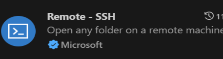
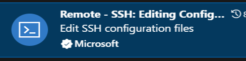

+++
title = 'Linux性能监视器开发'
date = 2024-11-22T00:12:29+08:00


categories = ["Linux" , "项目"]
tags = [ "Linux" , "项目"  ]

+++


# Linux配置

- 虚拟机配置建议是：
- 虚拟机ubuntu镜像不要低于18.04 选择net模式，30-40G硬盘大小
- 硬盘一定要设置30-40G大小 
- 在ubuntu git clone 代码，千万不要在windows上下载，拷贝过去，windows会改变代码中可执行文件的权限和格式

# git 环境配置

### **github ssh 免密配置**

```Plain
sudo apt install openssh-server
sudo systemctl status ssh
sudo ufw allow ssh
cd ~/.ssh    
```

若`.ssh`目录不存在，则执行下面步骤，记得邮箱改成你自己的github注册邮箱。执行`ssh-keygen`命令的时候，弹出的几个提示框**全都回车跳过**，不需要做任何操作。

```Bash
mkdir ~/.ssh

cat ~/.ssh/id_rsa.pub
```

拷贝`id_rsa.pub`文件内容，复制到github setting中的ssh keys里面，即配置成功ssh公钥


### **Ubuntu git 拉取项目代码**

使用如下命令克隆项目代码

```Bash
mkdir work 
cd work
git clone git@github.com:xxxxxxxxxxxxxxxxxxxxxxxx
```


## **vscode 远程ssh 到ubuntu** 

如果是虚拟机，安装`net-tool` 后用 ifconfig 命令可以查看当前虚拟机的IP地址。如果是云服务器，则直接去控制台看云服务器的公网IP。

```Bash
sudo apt install net-tools
# 查看ip的命令如下
ifconfig
```

随后 vscode 安装远程连接工具，进行连接







Remote ssh新增一个ssh链接，输入如下命令链接你的Linux主机，随后会弹出目标主机系统是什么，选择Linux后，输入你的ssh密码就可以链接远程主机了。

```Plain
ssh 用户名@IP地址
```


