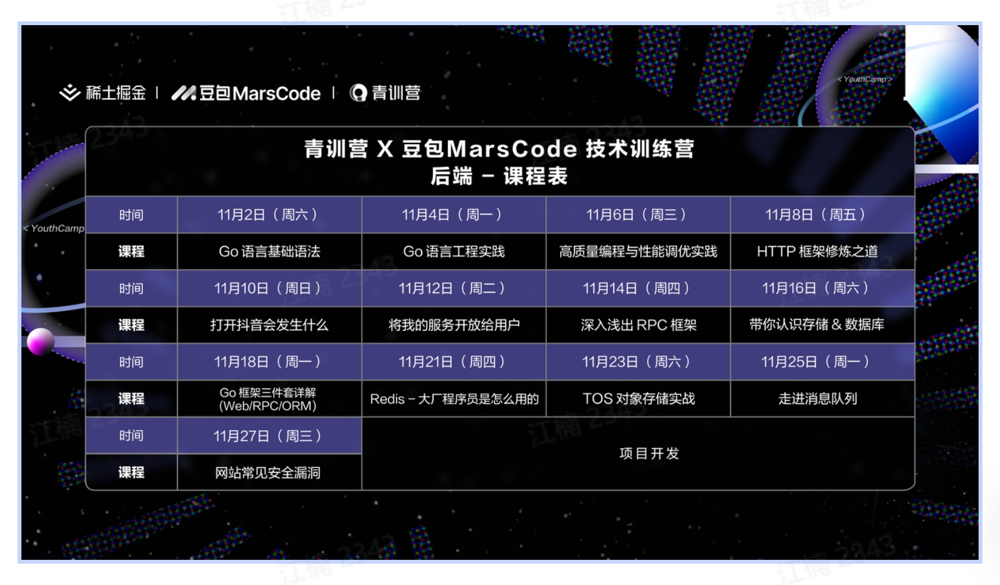

+++
title = '字节训练营记录'
date = 2024-11-01T19:33:34+08:00

categories = ["字节" ] 
tags = ["学习记录"]

+++

# 字节训练营

## 结营要求

- 刷题打卡 > 50 

- 每天3题

- 博客要写至少6篇

  

## 课程

1. 第一门课程 Go 语言上手-基础语言，也就是说现在你们听的这门课程。 主要讲述语言基础语法、入门实战
2. 第二门课程 Go 语言上手-工程实践 主要讲述 并发编程、依赖管理、单元测试、项目实战
3. 第三门课程 高质量编程与性能调优实战。主要讲述 编码规范、性能优化建议、性能分析工具使用、性能优化流程
4. 第四门课程 高性能 Go 语言发行版优化与落地实践。主要讲述 自动内存管理、Go 内存管理及优化、编译器和静态分析、Go 编译器优化

# 并发编程

1. 协程
2. 通道
3. sync

# 测试

# 电商项目

